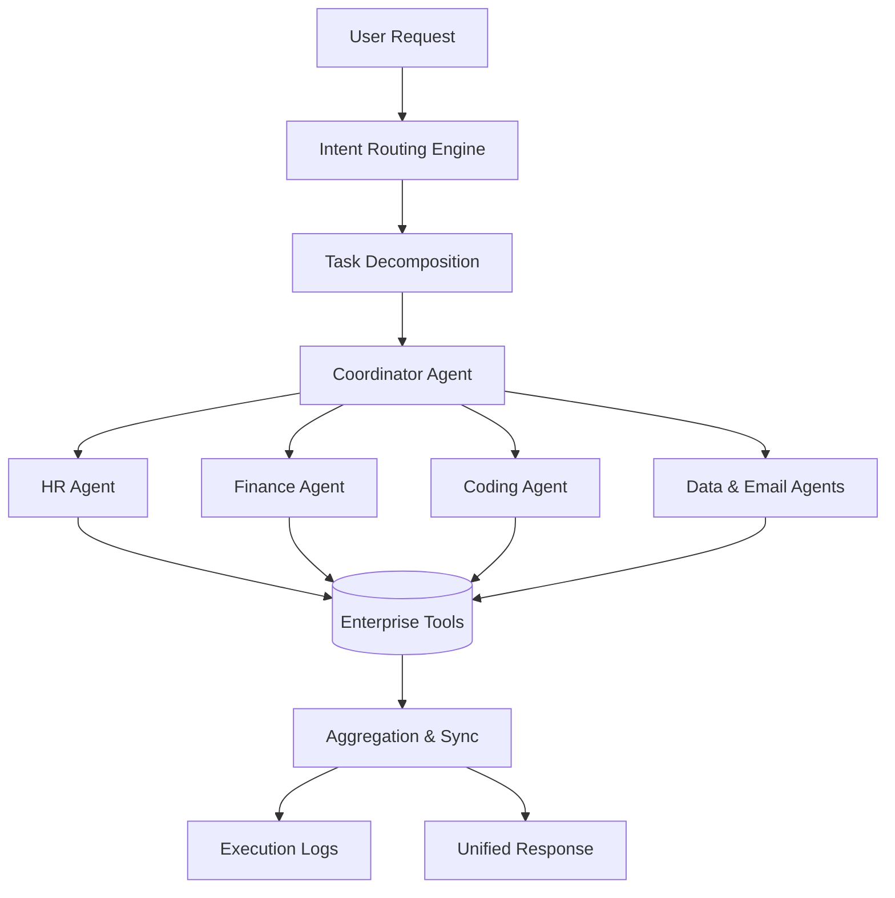

# Multi-Agent AI Business Assistant for Intelligent Enterprise Workflow Automation
Using Large Language Models, Multi-Agent Collaboration, and Enterprise Tool Integration.

### 1. Project Overview
Modern enterprise operations require seamless coordination across multiple functional domains, including Human Resources (HR), Finance, Software Engineering, Email Communication, Data Analytics, and Customer Support. However, traditional single-agent conversational AI systems struggle to execute complex cross-functional workflows.
This project proposes a Multi-Agent AI Business Assistant that automates and coordinates enterprise workflows using a collaborative architecture. 
The proposed system combines:
- Large Language Models (LLMs)
- Multi-Agent AI Collaboration
- Intelligent Intent Routing
- Event-Driven Message Bus
- Enterprise Tool Integration

The system analyzes complex user requests, decomposes them into domain-specific subtasks, routes them to specialized AI agents, and aggregates the results into a unified, transparent response.

### 2. Abstract
Business processes such as employee onboarding, financial reconciliation, software provisioning, and report generation often require collaboration across multiple departments, leading to delays and increased operational overhead. While existing approaches like rule-based RPA or basic multi-agent frameworks exist, they lack adaptability, security, and coordinated execution for real-world enterprise deployment.

The objective of this project is to develop an AI-based Multi-Agent Business Assistant designed specifically for enterprise workflow automation. The proposed system consists of six specialized AI agents coordinated by a centralized Coordinator Agent and an intelligent Intent Routing Engine. It focuses on secure digital enterprise workflow automation, scalable cross-domain collaboration, and maintaining structured execution logs for transparency and compliance.

### 3. Problem Statement
Modern enterprises face challenges in automating cross-functional workflows:
- Traditional single-agent AI systems lack domain-specific reasoning and tool integration.
- Rule-based Robotic Process Automation (RPA) lacks adaptability to dynamic enterprise scenarios.
- Complex tasks are bottlenecked by manual collaboration across departments.
- Current multi-agent frameworks (like AutoGen or CrewAI) offer limited support for enterprise-grade security, compliance, and auditability.

Therefore, there is a need for an automated system that can:
- Decompose complex, cross-departmental requests.
- Route tasks to specialized, domain-aware agents.
- Safely integrate with enterprise tools (payroll, SQL databases, email).
- Provide auditable, transparent execution logs.

### 4. Objectives
The main objectives of the project are:
- To improve task completion accuracy across complex workflows.
- To reduce workflow execution time and enhance operational efficiency.
- To orchestrate tasks securely using an intelligent Intent Routing Engine.
- To enable asynchronous inter-agent communication via an event-driven message bus.
- To provide a reliable, auditable, and extensible AI-driven business assistant.
- To ensure scalability, fault tolerance, and secure communication among agents for real-world enterprise environments.

### 5. Existing System
Existing automation and AI approaches include:
- **Rule-Based RPA:** Software bots automate repetitive tasks but fail when workflows require dynamic decision-making or natural language understanding.
- **Single-Agent Conversational AI:** Standard chatbots can answer questions but struggle with constrained context windows and lack deep integration with enterprise tools.
- **Basic Multi-Agent Frameworks:** Frameworks like AutoGen, CrewAI, and MetaGPT provide collaborative AI capabilities, but often lack enterprise-grade compliance, security routing, and strict auditability out-of-the-box.

However, individual approaches have limitations related to:
- Lack of adaptability to dynamic enterprise scenarios.
- Inability to coordinate complex, asynchronous cross-domain workflows.
- Difficulty in maintaining transparent execution logs for compliance.

### 6. Proposed System
The proposed system combines LLMs and Multi-Agent AI to perform intelligent enterprise workflow automation.

**General Workflow Diagram:**

### 7. System Architecture
The proposed architecture consists of the following major components:
**7.1 User Interface**
The user submits a complex business request (e.g., "Onboard new software engineer John Doe").
**7.2 Intent Routing Engine**
Analyzes the request and decomposes it into domain-specific subtasks.
**7.3 Specialized AI Agents**
Execute tasks using dedicated knowledge and integrated tools.
**7.4 Event-Driven Message Bus**
Facilitates asynchronous communication between agents.
**7.5 Enterprise Tool Integrations**
Connects agents to payroll calculators, SQL generators, code utilities, and email services.
**7.6 Coordinator Agent**
Manages task allocation, synchronization, dependency resolution, and response aggregation.
**7.7 Execution Logger**
Maintains structured execution logs for transparency and compliance.

### 8. Multi-Agent Architecture
The proposed system uses multiple specialized agents to perform different enterprise tasks:
- **Coordinator Agent:** Manages task allocation, dependency resolution, and aggregates final responses.
- **HR Agent:** Handles employee onboarding, policy queries, and personnel management.
- **Finance Agent:** Manages financial reconciliation, payroll calculations, and budget queries.
- **Coding Agent:** Handles software provisioning, code analysis utilities, and technical deployment.
- **Email Agent:** Drafts, reviews, and manages internal and external communications.
- **Data Analysis Agent:** Generates SQL queries, processes datasets, and generates reports.
- **Customer Support Agent:** Resolves client queries and manages ticketing workflows.

### 9. Enterprise Workflow Automation
Instead of relying on human managers to route tickets between departments, the Intent Routing Engine parses the initial prompt and triggers the necessary agents asynchronously. 
For example, an onboarding request triggers the HR Agent (paperwork), the Coding Agent (GitHub/system access), and the Email Agent (welcome email), all synchronized by the Coordinator Agent.

### 10. Task Execution and Auditing
The proposed system follows these major steps:
**Step 1:** User Request is submitted.
**Step 2:** Intent Routing Engine decomposes the request into a dependency graph.
**Step 3:** Task Allocation dispatches subtasks to Specialized Agents.
**Step 4:** Tool Execution occurs (e.g., executing a SQL query or sending an email).
**Step 5:** Asynchronous Communication updates the message bus upon task completion.
**Step 6:** Aggregation by the Coordinator Agent combines intermediate results.
**Step 7:** Final Verification ensures compliance and generates the final output and audit log.

### 11. Tool Integration and Security
The project emphasizes enterprise-grade security by equipping agents with specific, sandboxed tools rather than general access. 
- Payroll calculators for the Finance Agent.
- Read-only SQL query generators for the Data Analysis Agent.
- Authorized email APIs for the Email Agent.

### 12. Methodology and Development Plan
The project will be developed in the following stages:
**Phase 1 – Literature Survey:** Study recent research related to Multi-Agent frameworks, enterprise automation, and secure AI deployment.
**Phase 2 – Architecture Design:** Design the Intent Routing Engine and Event-Driven Message Bus.
**Phase 3 – Agent Development:** Develop the specialized prompts and tool integrations for the six domain agents.
**Phase 4 – Orchestration Integration:** Develop the Coordinator Agent to manage dependencies and task synchronization.
**Phase 5 – Enterprise Tool Mocking:** Integrate mockup enterprise APIs (payroll, SQL, email) for testing.
**Phase 6 – Evaluation:** Evaluate the system using workflow completion rates and execution time metrics.
**Phase 7 – User Interface:** Develop a dashboard to view agent interactions, system logs, and the final output.
**Phase 8 – Testing and Optimization:** Test the system with complex, cross-domain scenarios to ensure fault tolerance.

### 13. Technology Stack
*The exact technologies may evolve during development.*
- **Programming Language:** Python
- **Multi-Agent Frameworks:** LangGraph, CrewAI, or AutoGen
- **Large Language Models:** GPT-4, Gemini, or Llama 3
- **Message Bus/Queue:** Redis, RabbitMQ, or Kafka (for asynchronous communication)
- **Backend API:** FastAPI
- **Frontend:** React, HTML, CSS
- **Database/Logging:** PostgreSQL, Elasticsearch (for audit logs)

### 14. Expected Output
The final system is expected to provide a unified response and a transparent audit trail.
**Example:**
*User Request:* "Process onboarding for new developer Alice."
*Execution Log:*
- HR Agent: Verified employee records. (Status: SUCCESS)
- Finance Agent: Added Alice to payroll system. (Status: SUCCESS)
- Coding Agent: Provisioned GitHub and AWS access. (Status: SUCCESS)
- Email Agent: Sent welcome email and IT credentials. (Status: SUCCESS)
*Final Output:* "Onboarding for Alice is complete. All systems provisioned and welcome email sent."
*Audit Trail:* [Link to detailed JSON execution log for compliance]

### 15. Evaluation
The system will be evaluated using workflow automation metrics:
- **Task Success Rate:** Percentage of complex workflows completed without human intervention.
- **Execution Time:** Reduction in time compared to manual inter-departmental routing.
- **Error Recovery Rate:** Ability of the Coordinator Agent to handle and retry failed subtasks.
- **Tool Accuracy:** Precision of the specialized agents in using enterprise tools correctly (e.g., correct SQL syntax).

### 16. References

1. **Toudas, K., Roumeliotis, K. I., Nasiopoulos, D. K., & Georgakopoulos, G. (2026).**
   An Explainable AI Multi-Agent Recommender System for Financial Document Access Control.
   *Information Systems Frontiers.*
   > This paper proposes a multi-agent AI architecture with specialized agents and an orchestrator model that provides explainable decision-making and collaborative reasoning.

2. **Papageorgiou, G., Sarlis, V., Maragoudakis, M., & Tjortjis, C. (2025).**
   Hybrid Multi-Agent GraphRAG for E-Government: Towards a Trustworthy AI Assistant.
   *Applied Sciences*, 15(11), 6315.
   > This paper presents a hybrid multi-agent GraphRAG framework combining graph reasoning, retrieval-augmented generation (RAG), and web search to build trustworthy and explainable AI assistants.
